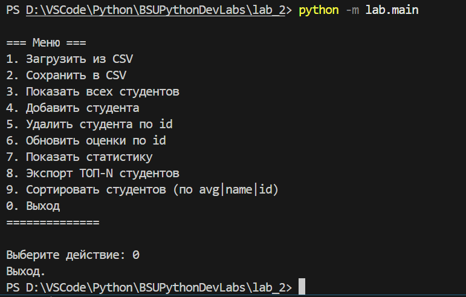
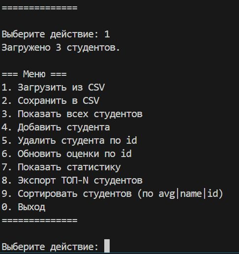
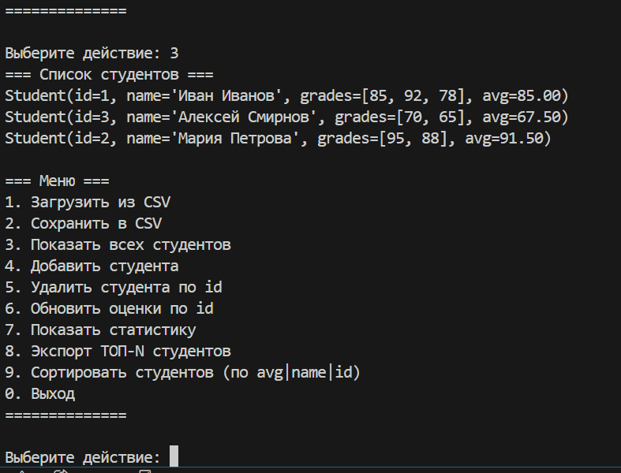
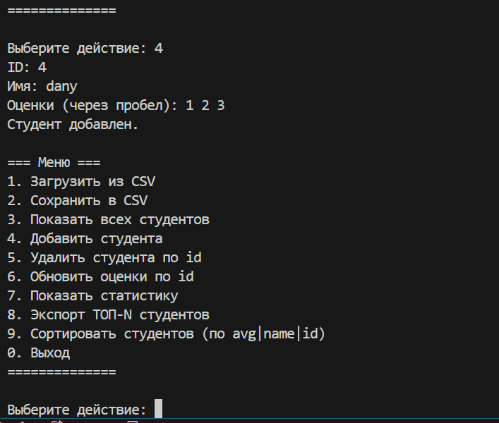
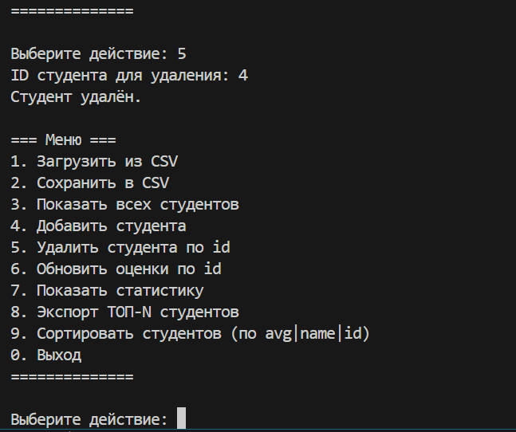
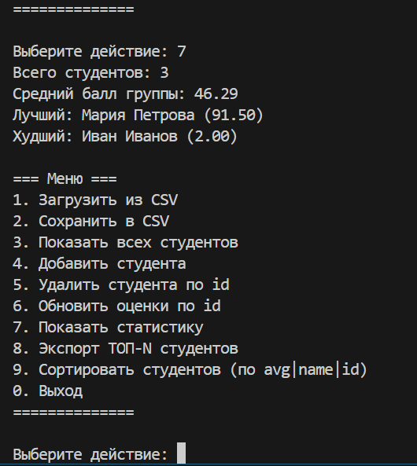
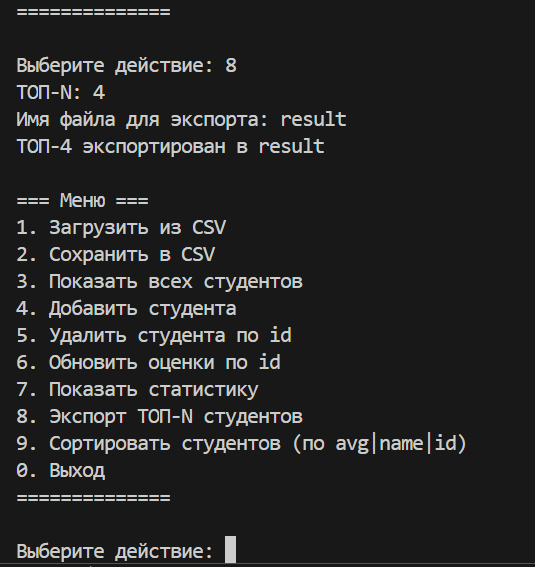
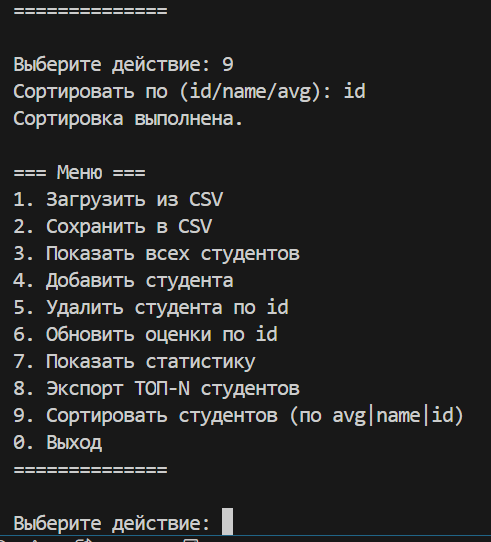

Отчет

```markdown
# Отчет по Лабораторной работе №2

## Цели и задачи

**Цель:** 
    - Освоить базовые конструкции Python: условия и циклы.
    - Научиться проектировать функции и процедуры, разбивать программу на модули и пакеты.
    - Применить коллекции Python (списки, словари) для хранения и обработки данных.
    - Освоить обработку ошибок и исключений, проектирование собственных исключений.
    - Научиться работать с файлами: чтение/запись и форматом CSV.
    - Освоить тестирование с помощью pytest

**Задачи:**
    1.  Спроектировать и реализовать модель данных для сущности "Студент".
    2.  Реализовать логику для чтения и записи данных в формате CSV с обработкой различных краевых случаев.
    3.  Реализовать функции для обработки данных: сортировка, расчет статистики.
    4.  Создать интерактивное консольное меню для взаимодействия с пользователем.
    5.  Обработать типичные ошибки.
    6.  Покрыть функциональность автоматическими тестами с использованием `pytest`.

## Архитектура проекта

Проект разбит на пакеты согласно требованиям в задании

*   `lab/`: Основной пакет приложения.
    *   `main.py`: Точка входа. Реализует консольный интерфейс.
    *   `models.py`: Определение моделей данных (класс `Student`(инкапсулирует данные о студенте и логику их валидации)).
    *   `io_utils.py`: Модуль для операций ввода-вывода. Содержит функции для чтения и записи CSV-файлов.
    *   `processing.py`: Модуль с функциями для бизнес-логики: сортировка студентов, расчет групповой статистики, экспорт данных.
    *   `errors.py`: Определяет иерархию пользовательских исключений для обработки ошибок, специфичных для логики приложения.
*   `tests/`: Пакет с тестами. Структура тестов такая же.

## Установка и запуск

### 1. Клонирование репозитория

```bash
git clone git@github.com:LordVillain/BSUPythonDevLabs.git
cd BSUPythonDevLabs/Lab_2
```

### 2. Инициализация окружения

```bash
# Установить все необходимые зависимости 
pip install -r requirements-dev.txt
```

### 3. Запуск

Для запуска интерактивного консольного меню выполните команду из корневой папки проекта (`lab2`):

```bash
python -m lab.main
```

Вы увидите меню с доступными опциями.

#### Меню


#### Выход


### 1 Загрузить студентов


### 2 Посмотреть список


### 3 Добавить студента


### 4 Удалить студента


### 5 Обновить оценки студента


### 6 Статистика по группе


### 7 Экспортировать TOP-N


### 8 Сортировать студентов



### Результаты тестов


