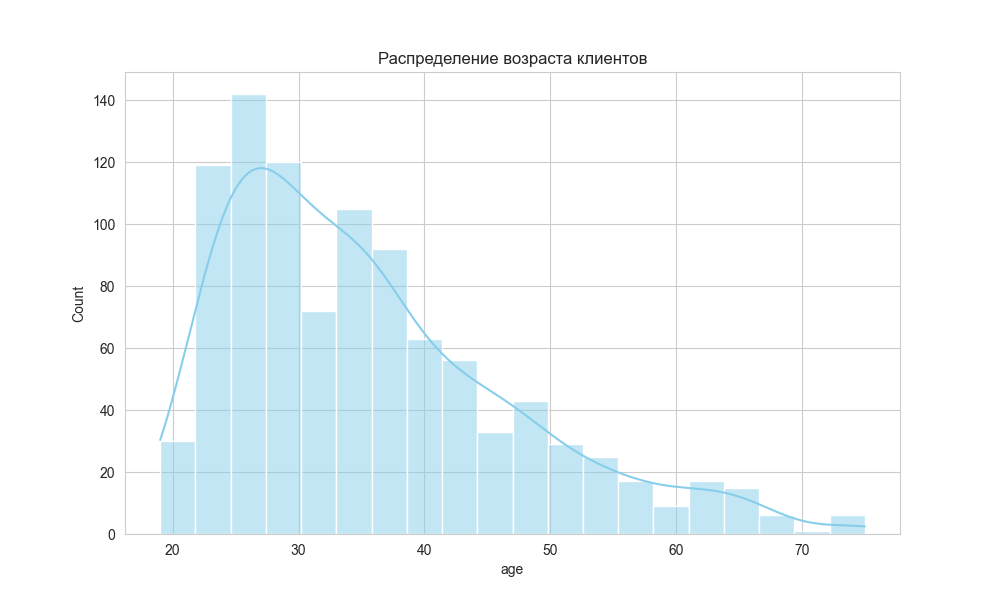
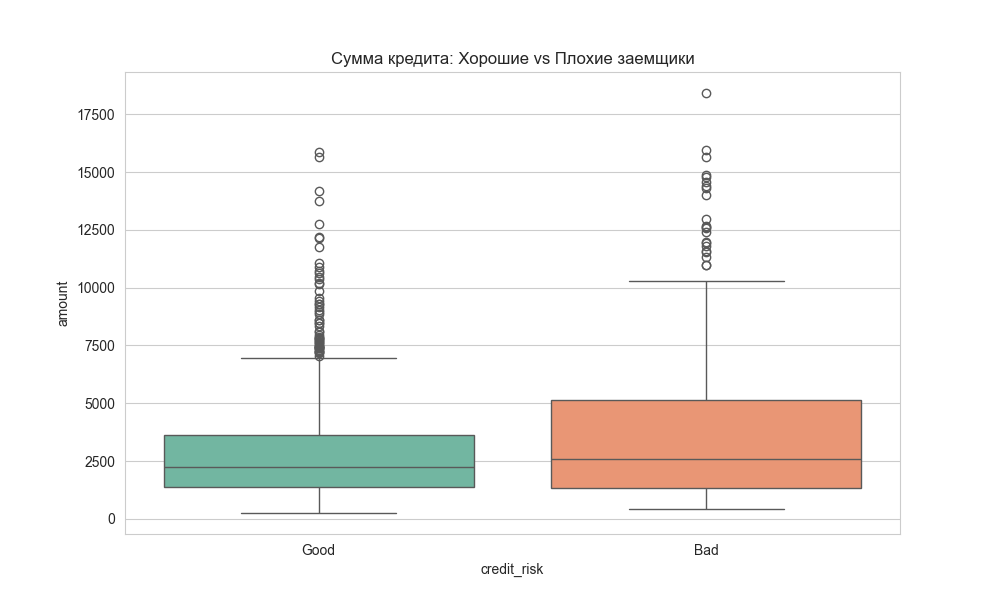
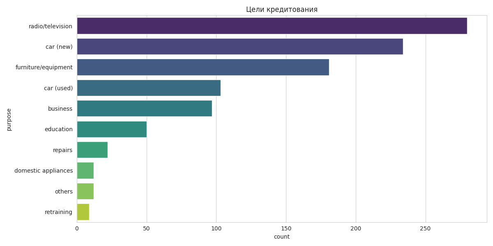
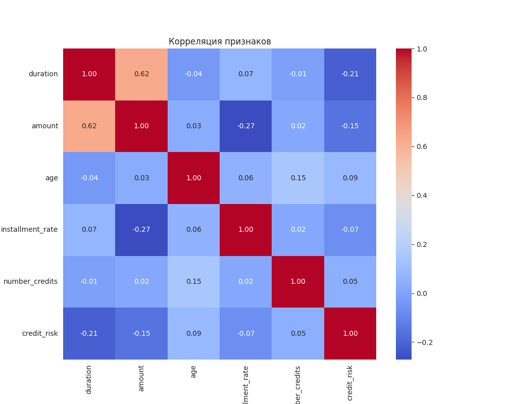

***

# Анализ набора данных "German Credit Data"

**Выполнил:** Ильинчик Даниил Александрович 
**Группа:** 4  
**Учебное заведение:** БГУ
**Факультет:** ФПМИ 
**Лабораторная работа №:** 3 
**Дата выполнения:** 02.12.2025

---

## 2. Введение

**Цель работы:** Проведение полного цикла анализа данных (ETL) набора "German Credit Data" для выявления ключевых факторов, влияющих на кредитный риск, а также закрепление навыков работы с библиотеками Python и языком SQL.

**Задачи:**
*   Загрузить и структурировать "сырые" данные.
*   Провести разведочный анализ данных (EDA).
*   Визуализировать распределения и взаимосвязи признаков.
*   Организовать хранение обработанных данных в реляционной базе данных (SQLite).

**Инструменты:** Python (pandas, matplotlib, seaborn, scikit-learn), SQLite.

---

## 3. Загрузка и подготовка данных

**Источник данных:**
Данные взяты из репозитория UCI Machine Learning Repository. Файл `german.data` не содержал заголовков, они были присвоены программно согласно официальной документации датасета.

**Структура данных:**
*   Количество наблюдений (строк): **1000**
*   Количество признаков (столбцов): **21** (7 числовых, 14 категориальных).

**Обработка пропущенных значений:**
В ходе проверки методом `.isnull().sum()` пропущенных значений в наборе данных **не обнаружено** (0 пропусков). Дополнительная импутация не потребовалась.

**Кодирование переменных:**
Исходные данные содержали закодированные значения (например, `A11`, `A34`).
1.  **Для аналитики и SQL:** Применено отображение (Mapping) через словарь для перевода кодов в человекочитаемый вид (например, `A34` -> `critical account`). Целевая переменная `1/2` преобразована в `Good/Bad`.
2.  **Для корреляционного анализа:** Категориальные строковые признаки были закодированы методом `Label Encoding` (преобразование в числа `0, 1, 2...`).

---

## 4. Анализ данных

**Числовые признаки (Статистика):**
*   **Возраст:** Средний возраст заемщика — **35.5 лет**. Минимальный — 19, максимальный — 75.
*   **Сумма кредита:** Средняя сумма — **3271 DM**. Медиана — 2319 DM. Это говорит о наличии "тяжелого хвоста" справа (выбросов в виде очень крупных кредитов до 18 424 DM).
*   **Длительность:** В среднем кредиты берутся на 21 месяц.

**Категориальные признаки:**
*   **Баланс классов (Credit Risk):**
    *   Good (Надежные): **70%** (700 чел.)
    *   Bad (Рискованные): **30%** (300 чел.)
    Выборка умеренно несбалансированная.

**Ключевые выводы:**
Большинство клиентов — молодые люди до 40 лет, берущие небольшие кредиты. Рискованная группа составляет треть выборки, что является значимым показателем для банковского дела.

---

## 5. Визуальный анализ

Для исследования были построены 4 типа графиков.

### 1. Распределение возраста

*Интерпретация:* Распределение имеет правостороннюю асимметрию. Основная масса заемщиков находится в диапазоне 25–35 лет. После 40 лет кредитная активность резко снижается.

### 2. Зависимость суммы кредита от риска (Boxplot)

*Интерпретация:* Медианная сумма кредита у "плохих" заемщиков (Bad) выше, чем у "хороших". Также в категории "Bad" чаще встречаются экстремально большие суммы кредитов (выбросы в верхней части графика).

### 3. Цели кредитования (Countplot)

*Интерпретация:* Самые популярные цели — покупка техники (радио/ТВ), новых автомобилей и мебели. Кредиты на переквалификацию (retraining) встречаются реже всего.

### 4. Корреляционная матрица

*Интерпретация:*
*   Наблюдается сильная положительная корреляция между **суммой кредита** и его **длительностью** (около 0.62). Это логично: большие суммы требуют большего времени на возврат.
*   Корреляция между возрастом и суммой кредита очень слабая — размер кредита практически не зависит от возраста клиента.

---

## 6. Работа с базой данных SQLite

**Структура БД:**
В файле `credit_data.db` создана таблица `clients`, содержащая 1000 записей и 21 столбец.

**Примеры выполненных SQL-запросов:**

1.  **Анализ средних чеков (Агрегация):**
    *Запрос:* Расчет средней суммы кредита в разрезе целей.
    *Результат:* Наиболее крупные суммы берутся на категорию "others" (в среднем >8000 DM) и подержанные авто. На бытовую технику берут небольшие суммы (~2600 DM).

2.  **Сравнение профилей риска (Группировка):**
    *Запрос:* `SELECT credit_risk, AVG(age), AVG(amount)... GROUP BY credit_risk`
    *Результат:*
    *   **Good:** Средний возраст 36.2 года, средний кредит 2985 DM.
    *   **Bad:** Средний возраст 33.9 года, средний кредит 3938 DM.
    *Вывод:* "Плохие" заемщики в среднем моложе и просят суммы на ~1000 DM больше.

3.  **Влияние жилья (Многоуровневая группировка):**
    *Запрос:* Подсчет количества `Good` и `Bad` клиентов для каждого типа жилья (`own`, `rent`, `free`).
    *Результат:* Владельцы собственного жилья (`own`) составляют большинство. Интересно, что среди тех, кто живет бесплатно (`for free`), доля невозвратов визуально выше, чем у собственников.

4.  **Сложная выборка (Фильтрация):**
    *Запрос:* Поиск клиентов с плохой кредитной историей (`critical account`), которым одобрили крупные суммы (>5000 DM).
    *Результат:* Найдено несколько десятков таких случаев. Большинство из них имеют работу уровня "skilled employee" или "management", что, вероятно, послужило причиной одобрения, несмотря на историю.

---

## 7. Итоговые выводы

В ходе работы установлено:
**1. Значимость признаков и обнаруженные взаимосвязи:**
*   **Сумма кредита (Credit Amount):** Является одним из самых сильных индикаторов риска. Визуальный анализ (Boxplot) показал, что медианная сумма кредита у неплательщиков («Bad») выше, чем у добросовестных заемщиков. Кроме того, в категории риска наблюдается значительно больший разброс сумм и наличие экстремальных выбросов (кредиты свыше 10 000 DM).
*   **Длительность кредита (Duration):** Обнаружена сильная прямая корреляция (**0.62**) между суммой и сроком кредита. Длительные кредиты на большие суммы статистически чаще попадают в категорию проблемных.
*   **Цель кредитования (Purpose):** Выявлена зависимость среднего чека от цели. Кредиты на «подержанные автомобили» и категорию «прочее» (others) имеют самые высокие средние суммы (более 5000-8000 DM), что автоматически повышает их профиль риска по сравнению с потребительскими кредитами на мебель или технику (~3000 DM).
*   **Возраст (Age):** Корреляция возраста с суммой кредита крайне слабая. Это означает, что сумма займа диктуется потребностью, а не возрастной группой клиента. Однако анализ SQL-выборок показал, что группа риска в среднем немного моложе надежных заемщиков (33.9 года против 36.2 лет).

**2. Портрет типичного клиента:**
*   **Демография:** Основная масса клиентов — мужчины в возрасте от 25 до 35 лет.
*   **Финансовое поведение:** Типичный запрос — кредит на сумму около 2300 DM (медиана) сроком на 12–18 месяцев.
*   **Цели:** Наиболее популярными причинами обращения в банк являются покупка электроники (радио/ТВ), новой машины или мебели.
*   **Собственность:** Большая часть клиентов владеет собственным жильем, однако группа клиентов с бесплатным проживанием (`for free`) требует дополнительного внимания, так как демонстрирует повышенную долю невозвратов.

**3. Рекомендации для банка:**
*   **Ужесточение рассмотрения кредитов для крупных сумм:** Рекомендуется внедрить дополнительную ступень проверки для заявок на сумму свыше **5000 DM**, так как именно в этом сегменте наблюдается наибольшая концентрация плохих кредитов.
*   **Сегментация по целям:** Особое внимание уделять заявкам с целью **«business»** и **«others»**. Высокий средний чек в этих категориях в сочетании с неопределенностью цели («others») создает повышенный риск дефолта.
*   **Работа с кредитной историей:** SQL-анализ выявил наличие клиентов со статусом `critical account` (критический счет), которым тем не менее были одобрены крупные суммы. Рекомендуется пересмотреть политику одобрения для таких клиентов, так как текущая модель, вероятно, недооценивает их риски.
*   **Мониторинг молодых заемщиков:** Учитывая, что средний возраст в группе риска ниже, для клиентов до 25 лет имеет смысл ограничивать максимальную сумму первого займа или требовать поручителей.

---

## 8. Заключение

1.  **Программная реализация:** Разработан модульный Python-скрипт, реализующий принципы чистого кода и разделения ответственности. Архитектура проекта, разделенная на слои конфигурации, обработки, визуализации и работы с БД, обеспечивает легкость поддержки и масштабируемость решения.
2.  **Аналитические компетенции:** Проведен анализ данных, который позволил выявить неочевидные закономерности. В частности, подтверждена гипотеза о том, что высокие суммы кредита и специфические цели (например, "бизнес" или "прочее") являются индикаторами повышенного риска. Визуализация данных наглядно продемонстрировала различия в поведении надежных и рискованных заемщиков.
3.  **Технические навыки:** Закреплены навыки работы с ключевыми библиотеками Data Science (`pandas` для манипуляций с данными, `seaborn` для графики) и интегрирования Python с реляционными базами данных (`SQLite`). Написанные SQL-запросы позволили провести агрегацию данных на стороне СУБД, что является важным навыком при работе с большими объемами информации.

**Дальнейшие направления:**
*   Применение алгоритмов машинного обучения для предсказания статуса `credit_risk`
*   Оборачивание модели прогнозирования в REST API

